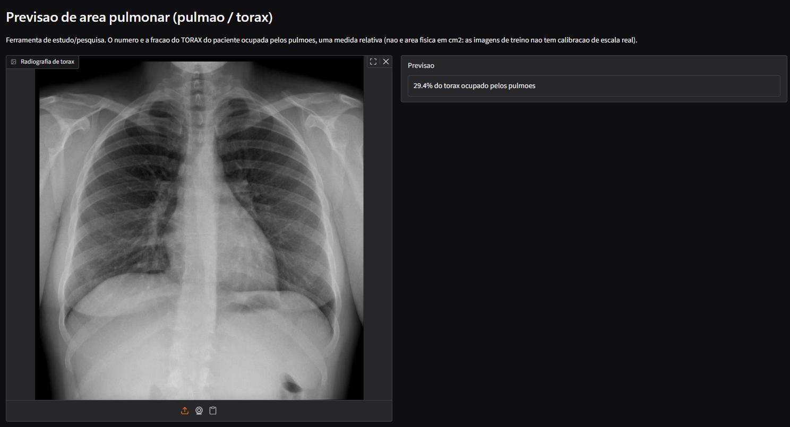
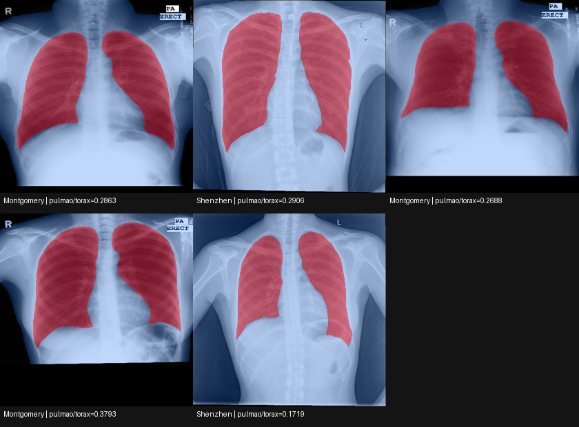

# MedGemma Lung LoRA: Análise de Radiografia de Tórax com IA

Projeto de estudo prático sobre fine-tuning de modelos de IA médica, usando o
[MedGemma](https://huggingface.co/google/medgemma-4b-it) do Google (variante
médica do Gemma 3) para analisar radiografias de tórax: geração de laudo por
checklist e, principalmente, um experimento completo de fine-tuning com LoRA
para prever a proporção pulmão/tórax visível na imagem.

O objetivo aqui foi aprender o processo de fine-tuning de modelos de IA
aplicados à medicina. Não é uma ferramenta clínica pronta. Os resultados
devem ser lidos como um exercício de aprendizado, documentado com os erros e
correções reais que aconteceram no caminho.



## O que tem aqui

Duas frentes. A primeira é um laudo por checklist (`src/analisar_rx.py` +
`src/app_web.py`), que usa o MedGemma direto, em modo texto, para gerar uma
leitura estruturada da radiografia: 14 itens, cobrindo qualidade técnica,
mediastino (compartimento central do tórax, entre os pulmões), campos
pulmonares, seios costofrênicos (o ângulo entre o diafragma e a parede
torácica, onde líquido pleural costuma se acumular primeiro), e assim por
diante.

A segunda, e o núcleo do projeto, é a previsão de área pulmonar: um pipeline
completo de fine-tuning que ensina o modelo a prever que fração do tórax do
paciente é ocupada pelos pulmões, a partir só da imagem.

## Como funciona a previsão de área pulmonar

### 1. Dado de treino

Usamos o dataset público [Montgomery + Shenzhen Chest X-ray Segmentation](https://data.mendeley.com/datasets/8gf9vpkhgy/2)
(CC BY 4.0, 704 imagens com máscara de pulmão já anotada por especialistas).
Como o dataset só tem máscara de *pulmão*, calculamos a máscara do *tórax*
(silhueta do corpo do paciente) por conta própria, via limiarização de
intensidade: o ar fora do paciente não atenua o raio-X e fica bem mais
escuro que qualquer tecido do corpo, então dá pra separar corpo de fundo só
pelo brilho do pixel.



*Isso não é o modelo "olhando" a imagem: é o gabarito usado para calcular o
rótulo de cada radiografia antes do treino. O modelo em si não produz esse
desenho, ele aprende a devolver só o número final (a razão entre as duas
áreas).*

O rótulo de treino é `área do pulmão ÷ área do tórax`, não
`área do pulmão ÷ imagem inteira`. Essa escolha foi deliberada (ver seção
de decisões abaixo) e torna a métrica invariante ao quanto a foto foi
enquadrada ou cortada ao redor do corpo.

### 2. Extração de embeddings + linear probe

Primeiro experimento: usamos o `vision_tower` (encoder de imagem) do
MedGemma congelado, sem treinar nada nele, e treinamos só uma camada linear
simples em cima da média dos embeddings de imagem (a representação numérica
que o encoder gera para cada radiografia), prevendo a fração pulmão/tórax.
O resultado foi um erro médio de ~2,4 pontos percentuais na validação.
Razoável, mas com limitações reais em imagens fora do dataset de treino
(ver seção de resultados).

### 3. Fine-tuning com LoRA

Para melhorar a precisão em casos fora da distribuição de treino, aplicamos
LoRA (Low-Rank Adaptation) nas últimas 6 camadas de atenção do
`vision_tower` (de 27 no total), treinado junto com o cabeçote de regressão,
dessa vez de ponta a ponta e não mais sobre embeddings congelados. O
resultado final foi 1,98% de erro médio na validação, com melhora mensurável
de generalização em imagens externas (detalhes abaixo).

## Resultados

### Curva de treino do LoRA (8 épocas, amostradas abaixo)

| Época | Perda treino | MAE validação |
|---|---|---|
| 1 | 0,18295 | 4,59% |
| 2 | 0,00296 | 3,36% |
| 4 | 0,00148 | 2,62% |
| 6 | 0,00105 | 2,19% |
| 8 | 0,00083 | **1,98%** |

### Teste em 4 imagens reais de fora do dataset de treino

Antes e depois do fine-tuning com LoRA, nas mesmas 4 imagens (nunca vistas
em treino nem validação):

| Imagem | Cabeçote linear (congelado) | Com LoRA |
|---|---|---|
| RX em expiração | 27,3% | 24,2% |
| RX em inspiração (mesmo paciente) | 27,5% | 26,1% |
| RX pós-cirurgia cardíaca | 39,4% (outlier) | 30,6% |
| RX em decúbito ventral | 27,7% | 29,5% |

Dois achados importantes desse teste. O primeiro é sensibilidade a
inspiração/expiração: o par do mesmo paciente deveria mostrar mais área
pulmonar na inspiração, já que o pulmão fica mais cheio de ar. O cabeçote
linear captava isso muito fracamente (diferença de só 0,2 pontos). Com
LoRA, a diferença subiu para 1,9 pontos, na direção clinicamente correta.

O segundo é generalização em caso atípico: a radiografia pós-cirúrgica (com
fios de esternotomia, achado que não aparece no dataset de treino) tinha um
valor bem fora da curva com o cabeçote linear. Com LoRA, ficou muito mais
próximo dos demais casos.

A quarta imagem, em decúbito ventral (paciente deitado de bruços, postura
incomum para raio-X de tórax), também mudou bastante entre os dois modelos
(27,7% → 29,5%), mas essa eu não sei interpretar com confiança: não existe
gabarito para essa imagem, e a própria mudança de postura já altera a
projeção e o enquadramento do exame de um jeito que o modelo nunca viu no
treino. Fica registrado como um resultado incerto, não como acerto.

## Decisões de design (e os erros no caminho)

Esse projeto teve vários obstáculos reais, documentados aqui de propósito,
porque são a parte mais instrutiva do processo.

**Por que pulmão/tórax, e não pulmão/imagem.** A primeira versão calculava
a fração da imagem inteira ocupada pelo pulmão. Testando com uma imagem
mais cortada, com menos fundo preto ao redor do corpo, o valor disparou
para o teto do que o modelo via no treino. O enquadramento da foto, não a
fisiologia, estava dominando o número. Redefinir o rótulo como pulmão/tórax
resolveu isso.

**O bug do limiar de Otsu.** A primeira tentativa de segmentar o tórax
usava limiarização automática (Otsu). Em algumas imagens, o algoritmo
encontrou o limiar entre "pulmão escuro" e "osso claro" em vez de entre
"fundo" e "corpo", fragmentando o tórax em pedaços desconectados e dando um
rótulo quase zero. A solução foi um limiar fixo e baixo, já que o fundo
real é praticamente zero e até o pulmão, a parte mais escura do corpo, já
fica bem acima disso.

**VRAM e o travamento de 3 horas.** A primeira tentativa de treino com LoRA
ficou presa por horas sem terminar. A causa raiz tinha duas partes. Uma: o
pipeline carregava o modelo MedGemma completo, incluindo o language_model
(2,28 bilhões de parâmetros, 10,8x o tamanho do vision_tower), mesmo sem
usá-lo. Duas: isso deixava a VRAM da GPU no limite, e o Windows, nesse
ponto, passa a usar memória compartilhada com a RAM (dezenas de vezes mais
lenta) sem avisar. A correção foi descartar o language_model logo após
carregar, e aplicar o LoRA só nas últimas camadas do encoder. O
`gradient_checkpointing` (técnica que economiza VRAM recalculando ativações
durante o backward em vez de guardá-las todas na memória), testado como
alternativa, não é realmente implementado nessa versão do encoder do
MedGemma apesar de declarar suporte.

## Limitações importantes

Não é dispositivo médico. O MedGemma é distribuído pelo Google como
ferramenta de pesquisa e educação, sem validação clínica regulatória. Nada
aqui deve embasar decisão clínica real.

A métrica é relativa, não uma medida física. "% pulmão/tórax" não é volume
em litros nem área em cm²: as imagens de treino não têm calibração de
escala física (distância de aquisição), então não dá pra converter pixel em
medida real. Uma radiografia é uma projeção 2D, volume pulmonar é uma
grandeza 3D. No melhor caso, esse número é um proxy visual aproximado, não
uma medida de função pulmonar.

O dataset de treino é pequeno e específico: 704 imagens de dois programas
de triagem de tuberculose (EUA e China), não representativas de qualquer
serviço de radiologia, aparelho ou população.

Há viés herdado do gabarito: a máscara de pulmão original já sub-marca o
seio costofrênico, região de baixo contraste e difícil de anotar, e o
modelo herda esse viés.

## Estrutura do projeto

```
Medgemma-RX/
├── requirements.txt
├── checkpoints/
│   ├── cabecote.pt              cabecote linear (metrica antiga, pulmao/imagem)
│   ├── cabecote_lora.pt         cabecote treinado junto com o LoRA
│   └── lora_vision/             adapter LoRA (vision_tower)
└── src/
    ├── analisar_rx.py           laudo por checklist (MedGemma em modo texto)
    ├── app_web.py                interface web do laudo (Gradio)
    ├── preparar_dados.py         calcula o rotulo pulmao/torax a partir das mascaras
    ├── verificar_dados.py        grade visual de conferencia dos rotulos
    ├── extrair_embeddings.py     extrai embeddings congelados do vision_tower
    ├── treinar_cabecote.py       treina o cabecote linear (linear probe)
    ├── treinar_lora.py           fine-tuning real: LoRA + cabecote, ponta a ponta
    ├── prever_area.py            inferencia com o cabecote linear puro
    ├── prever_area_lora.py       inferencia com o adapter LoRA
    └── app_area.py                interface web da previsao de area (Gradio)
```

`dados/` (imagens, dataset baixado, embeddings) fica só local e nunca sobe
pro repositório, por ser dado potencialmente sensível e/ou grande demais
pro git.

## Como rodar

Requer Python 3.14, GPU NVIDIA com CUDA, e uma conta no Hugging Face com
acesso liberado ao [google/medgemma-4b-it](https://huggingface.co/google/medgemma-4b-it),
modelo com licença restrita que exige aceitar os termos na página antes de
baixar.

```bash
python -m venv .venv
.venv\Scripts\python.exe -m pip install torch --index-url https://download.pytorch.org/whl/cu132
.venv\Scripts\python.exe -m pip install -r requirements.txt
.venv\Scripts\hf.exe auth login   # cole seu token do Hugging Face

# laudo por checklist
.venv\Scripts\python.exe src\app_web.py

# previsao de area pulmonar (precisa preparar o dado antes, ver preparar_dados.py)
.venv\Scripts\python.exe src\app_area.py
```

## Aplicações possíveis com um treinamento maior

O que está aqui é um experimento em escala pequena, mas a técnica generaliza
para problemas clinicamente mais relevantes se treinada com mais dado e
rótulos melhores. Algumas direções que fazem sentido:

**Sinalizar rigidez inspiração/expiração como marcador de DPOC.** Conecta
direto com o teste acima: num pulmão saudável a área pulmonar muda de forma
perceptível entre inspiração e expiração; em DPOC com componente
enfisematoso, o aprisionamento aéreo reduz essa diferença em vez de
aumentá-la. Um modelo treinado com dataset pareado de inspiração/expiração
e rótulo de função pulmonar real poderia sinalizar esse padrão como um
segundo olhar objetivo antes da leitura formal.

**Índice cardiotorácico automatizado.** É a extensão mais direta do que já
existe aqui: a mesma lógica de treino, prever uma razão entre duas
silhuetas segmentadas, aplicada à silhueta cardíaca sobre a torácica em vez
de pulmão sobre tórax. A vantagem sobre o restante desta lista é que o
índice cardiotorácico já é uma métrica clínica estabelecida, com corte de
referência conhecido (acima de 50% sugere cardiomegalia), então a validação
tem um padrão-ouro claro para comparar, em vez de depender só de
concordância com outro modelo de IA.

**Assimetria entre hemitórax direito e esquerdo.** O pipeline atual reduz a
imagem inteira a um número único. Segmentar e comparar os dois lados
separadamente permitiria detectar assimetrias significativas, o que pode
sinalizar atelectasia unilateral, derrame localizado, ou obstrução
brônquica unilateral (mecanismo de válvula, comum em corpo estranho
aspirado por criança). É extensão de engenharia relativamente simples sobre
o que já existe: treinar a segmentação para distinguir os dois pulmões em
vez de tratá-los como uma região só.

**Monitorização seriada de congestão pulmonar em insuficiência cardíaca.**
Paciente internado por insuficiência cardíaca descompensada costuma fazer
várias radiografias na mesma internação para acompanhar resposta a
diurético. Comparar a razão pulmão/tórax entre esses exames sucessivos
daria uma tendência numérica objetiva de evolução, complementando a
comparação visual entre exames de dias diferentes, que tem variabilidade
relevante entre observadores. A mesma lógica vale para qualquer condição
acompanhada por exame seriado.

**Controle de qualidade do enquadramento como etapa automática anterior à
análise.** Vem direto da própria experiência deste projeto: a imagem em
decúbito ventral (ver seção de Resultados) só foi identificada como
atípica porque alguém inspecionou o resultado visualmente, não porque o
pipeline soubesse reconhecer a postura de aquisição sozinho. Um
classificador simples, treinado para reconhecer a postura do exame (PA
padrão, AP portátil, decúbito, incidência lateral) e rodando antes da
análise principal, serviria como aviso automático de que aquela imagem
foge do padrão esperado e a métrica deve ser interpretada com cautela, ou
nem calculada.

**Hiperinsuflação em pediatria.** Mesma física do item de DPOC, população
diferente: em pronto-socorro pediátrico, mais área pulmonar visível e
diafragma retificado são sinais usados como indicador de gravidade em
quadros obstrutivos agudos (bronquiolite, crise asmática), avaliação que
tem variabilidade relevante entre observadores. Um escore objetivo de área
pulmonar, calibrado numa população pediátrica (bem diferente da população
adulta usada aqui), poderia ajudar a padronizar essa parte da avaliação.

**Quantificação de derrame pleural e de pneumotórax.** Duas aplicações do
mesmo princípio geométrico, ambas com precedente na literatura de
radiologia quantitativa: o tamanho de um pneumotórax já é estimado por
métodos geométricos como o índice de Light, e o volume de um derrame
pleural pode ser aproximado pela altura da coluna de líquido visível. Um
modelo treinado para essas tarefas devolveria uma estimativa objetiva de
tamanho em vez de uma descrição qualitativa ("pequeno", "moderado",
"volumoso"), útil para acompanhar resposta a toracocentese ou drenagem.

**Triagem em programas populacionais de rastreamento.** Fecha o ciclo com a
origem dos próprios dados usados aqui: os datasets Montgomery e Shenzhen
foram construídos originalmente para programas de rastreamento de
tuberculose. Uma versão bem validada desta abordagem poderia servir a esse
mesmo tipo de programa, sinalizando radiografias com proporção pulmonar
grosseiramente fora do esperado para revisão prioritária do radiologista,
como ferramenta de eficiência em cenários de alto volume e baixo recurso,
nunca substituto da leitura profissional.

Nenhuma dessas aplicações é viável só com o que está neste repositório. Cada
uma exigiria dataset próprio, com rótulo clínico real em vez de um proxy
calculado de máscara, validação contra leitura de radiologista, e
provavelmente aprovação regulatória antes de qualquer uso além de pesquisa.

## Créditos e licenças

MedGemma é do Google, sob os termos do
[Health AI Developer Foundations](https://developers.google.com/health-ai-developer-foundations/medgemma).

O dataset de segmentação pulmonar é de Danilov, V., Proutski, A., Kirpich,
A., Litmanovich, D., Gankin, Y. *Chest X-ray dataset for lung segmentation*.
Mendeley Data, V2, 2022. [doi: 10.17632/8gf9vpkhgy.2](https://doi.org/10.17632/8gf9vpkhgy.2)
(CC BY 4.0). Combina os datasets Montgomery e Shenzhen, originalmente
publicados pela U.S. National Library of Medicine (Jaeger et al., 2014).
